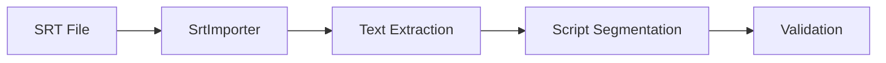

# 逻辑流与架构设计 (Logic Flows & Architecture)

> 本文档描述系统的核心工作流逻辑、数据流向和关键决策点。
> **注意**: 修改 `src/workflows/` 代码时，必须同步更新本文档。

## 1. 全局架构概览

系统采用分层架构，核心逻辑由 **Workflows** 编排，调用无状态的 **Tools** 和有状态的 **Agents** 完成任务。

```mermaid
graph TD
    User[用户] --> API[FastAPI Backend]
    API --> PM[ProjectManager V2]
    PM --> WF[Workflows]
    
    subgraph "Workflows (Orchestration)"
        WF --> NPW[Novel Processing Workflow]
        WF --> SPW[Script Processing Workflow]
        WF --> PPS[Preprocess Service]
    end
    
    subgraph "Core Logic"
        NPW --> Tools[Tools (Stateless)]
        SPW --> Tools
        NPW --> Agents[Agents (Stateful)]
    end
    
    subgraph "Data Layer"
        Tools --> Schema[Pydantic Schemas]
        Tools --> Storage[File System / JSON]
    end
```

## 2. 小说处理工作流 (Novel Processing Workflow)

**文件**: `src/workflows/novel_processing_workflow.py`

该工作流负责将原始小说文本转换为结构化的分析数据。

### 2.1 流程图

```mermaid
graph LR
    Input[Raw Text] --> Import[NovelImporter]
    Import --> Meta[Metadata Extraction]
    Meta --> Chapters[Chapter Detection]
    Chapters --> Seg[Segmentation (Two-Pass)]
    Seg --> Annot[Annotation (Two-Pass)]
    Annot --> System[System Detection]
    System --> Output[Structured Data]
```

### 2.2 关键步骤详解

#### Step 1: 导入与元数据 (Import & Metadata)
- **工具**: `NovelImporter`, `NovelMetadataExtractor`
- **逻辑**: 
  1. 检测文件编码并转换为 UTF-8。
  2. 使用 LLM (DeepSeek v3.2) 提取标题、作者、简介等元数据。

#### Step 2: 章节检测 (Chapter Detection)
- **工具**: `NovelChapterDetector`
- **逻辑**: 基于正则规则识别章节标题，分割文本。

#### Step 3: 叙事分段 (Segmentation) ⭐ **Core**
- **工具**: `NovelSegmenter`
- **策略**: **Two-Pass**
  - **Pass 1**: 初步分段，识别 A(设定)/B(事件)/C(系统) 类型。
  - **Pass 2**: 校验分段边界，修正过度分段或漏分。
- **原则**: 仅在时空变化、叙事功能转变时分段。

#### Step 4: 标注与分析 (Annotation)
- **工具**: `NovelAnnotator`
- **策略**: **Two-Pass**
  - **Pass 1**: 提取事件摘要、出场角色。
  - **Pass 2**: 关联 A 类设定到 B 类事件。

#### Step 5: 系统元素检测 (System Detection)
- **工具**: `NovelSystemDetector`
- **逻辑**: 独立 Pass，扫描 C 类段落，识别并更新系统元素目录。

## 3. 脚本处理工作流 (Script Processing Workflow)

**文件**: `src/workflows/script_processing_workflow.py`

该工作流负责处理 SRT 字幕或剧本文件。

### 3.1 流程图



### 3.2 关键步骤详解

#### Step 1: 文本提取
- **工具**: `SrtTextExtractor`
- **逻辑**: 合并碎片化的字幕行，重建完整的对话句子。

#### Step 2: 语义分段
- **工具**: `ScriptSegmenter`
- **策略**: ABC 分类法 (同小说分段)。

## 4. 预处理服务 (Preprocess Service)

**文件**: `src/workflows/preprocess_service.py`

负责后台异步处理文件上传后的初始化工作。

- **触发**: 文件上传 API (`POST /api/v2/projects/{id}/files`)
- **任务**:
  1. 识别文件类型 (Novel/Script)。
  2. 运行 Importer。
  3. 运行 Metadata Extractor。
  4. 运行 Chapter Detector (仅小说)。
- **状态管理**: 通过 `ProjectManagerV2` 更新 `preprocess` 阶段状态。

## 5. 数据流向 (Data Flow)

1. **Raw Data**: `data/projects/{id}/raw/`
2. **Intermediate**: `data/projects/{id}/processed/` (JSON files)
3. **Artifacts**: `data/projects/{id}/artifacts/` (Versioned outputs)

所有工具必须遵循 **单一数据源** 原则，读取上一阶段的输出，生成新的输出，**禁止** 修改原始输入。
